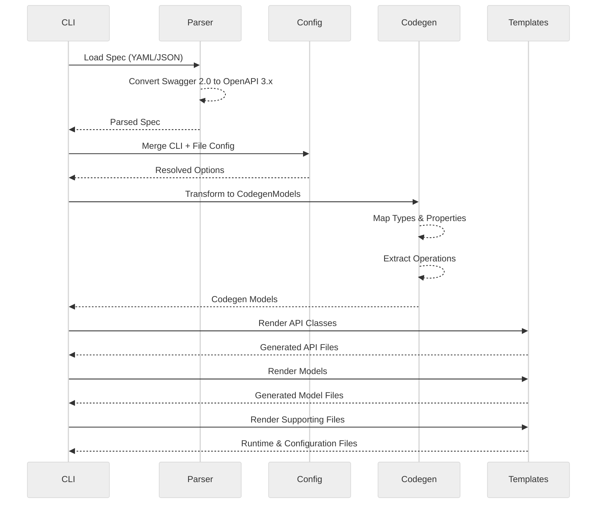

<h1 align="center">OpenAPI Generator</h1>

<p align="center">
A Go implementation of the OpenAPI Generator inspired by the original Java-based project.
</p>

## Why

I ran into issues with Java dependencies and performance in large projects, and
many issues stay unresolved in the repository for a long time. I want to build
something simpler, easier to maintain, and portable as a single binary with
minimal dependencies.

## Features

- Single binary for easy installation and use
- Fast generation times without JVM overhead
- Load specs from local files or remote URLs
- Command-line interface compatible with the original OpenAPI Generator
- Supports OpenAPI 3.x and Swagger 2.0 specifications (auto-converts 2.0 → 3.x)

## Generators

Currently implemented:

- [typescript-fetch](./templates/typescript-fetch/README.md)

## Installation

```bash
go install github.com/xseman/openapi-generator/cmd/openapi-generator@latest
```

## Usage

```bash
openapi-generator generate \
  -i openapi.yaml \
  -g <template> \
  -o ./generated \
  -p key=value \
  -c config.yaml \
  --verbose
```

**Template-Specific Usage:**

- [typescript-fetch](./templates/typescript-fetch/README.md#usage)

## CLI Options

| Option                      | Short | Description                                      |
| --------------------------- | ----- | ------------------------------------------------ |
| `--input-spec`              | `-i`  | Location of the OpenAPI spec (file or URL)       |
| `--generator-name`          | `-g`  | Generator to use (currently: typescript-fetch)   |
| `--output`                  | `-o`  | Output directory                                 |
| `--config`                  | `-c`  | Configuration file (JSON/YAML)                   |
| `--template-dir`            | `-t`  | Custom template directory                        |
| `--additional-properties`   | `-p`  | Key=value pairs for generator options            |
| `--skip-validate-spec`      |       | Skip OpenAPI spec validation                     |
| `--verbose`                 | `-v`  | Enable verbose output                            |

**Note:** For generator-specific options, see the template documentation (e.g., [typescript-fetch options](./templates/typescript-fetch/README.md#usage)).

## Architecture

### Generation Pipeline



### Core Components

| Component     | Package              | Description                                    |
| ------------- | -------------------- | ---------------------------------------------- |
| **Parser**    | `internal/parser`    | Parses OpenAPI 2.0/3.x specs using kin-openapi |
| **Codegen**   | `internal/codegen`   | Data structures mirroring Java's CodegenModel  |
| **Generator** | `internal/generator` | Generator interface and implementations        |
| **Template**  | `internal/template`  | Mustache template engine with lambdas          |
| **Config**    | `internal/config`    | Configuration structs for generators           |

### Dependencies

| Library                         | Purpose                       |
| ------------------------------- | ----------------------------- |
| `github.com/getkin/kin-openapi` | OpenAPI 3.x and 2.0 parsing   |
| `github.com/cbroglie/mustache`  | Mustache template rendering   |
| `github.com/spf13/cobra`        | CLI framework                 |

## Development

```bash
# Build
go build -o openapi-generator ./cmd/openapi-generator

# Run tests
go test ./...

# Generate from a spec
./openapi-generator generate \
    -i petstore.yaml \
    -g typescript-fetch \
    -o ./out

# List available generators
./openapi-generator list

# Show config options for a generator
./openapi-generator config-help typescript-fetch
```
