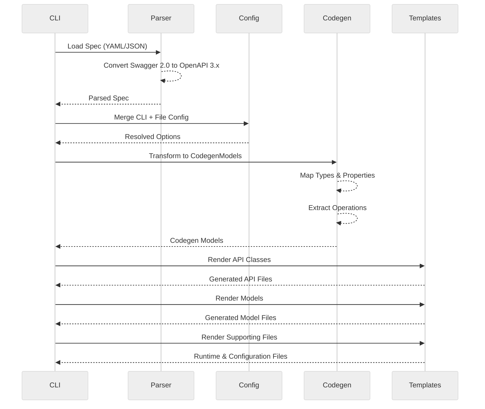

<h1 align="center">OpenAPI Generator</h1>

<p align="center">
A Go implementation of the OpenAPI Generator inspired by the original Java-based project.
</p>

## Why

I ran into issues with Java dependencies and performance in large projects, and
many issues stay unresolved in the repository for a long time. I want to build
something simpler, easier to maintain, and portable as a single binary with
minimal dependencies.

## Features

- Single binary for easy installation and use
- Fast generation times without JVM overhead
- Load specs from local files or remote URLs
- Command-line interface compatible with the original OpenAPI Generator
- Supports OpenAPI 3.x and Swagger 2.0 specifications (auto-converts 2.0 -> 3.x)

## Installation

```sh
curl -fsSL https://raw.githubusercontent.com/xseman/openapi-generator/master/install.sh | sh
```

The script downloads the release binary for this platform, checks it against
the release's `CHECKSUMS.txt` and puts it in `~/.local/bin`.
`OPENAPI_GENERATOR_VERSION` pins a release, `OPENAPI_GENERATOR_INSTALL_DIR`
changes where it lands. Later, `openapi-generator update` installs the newest
release over the binary the same way.

**Windows:** download `openapi-generator-windows-amd64.exe` (or `arm64`) from
the [latest release](https://github.com/xseman/openapi-generator/releases/latest)
and put it on your `PATH`; `openapi-generator update` works there too.

### From Source

```bash
go install github.com/xseman/openapi-generator/cmd/openapi-generator@latest
```

## Templates

### Client

- [typescript-fetch](./templates/typescript-fetch/README.md)
- [dart-fetch](./samples/dart-fetch/README.md)

### Server

- (Coming soon)

## Usage

```bash
openapi-generator generate \
    -i openapi.yaml \
    -g <template> \
    -o ./generated \
    -p key=value \
    -c config.yaml \
    --verbose
```

Validate a spec without generating code (exits with status 1 on errors;
`--recommend` also lists unused models):

```bash
openapi-generator validate -i openapi.yaml --recommend
```

## CLI Options

### `generate`

| Option                      | Short | Description                                      |
| --------------------------- | ----- | ------------------------------------------------ |
| `--input-spec`              | `-i`  | Location of the OpenAPI spec (file or URL)       |
| `--generator-name`          | `-g`  | Generator to use: typescript-fetch, dart-fetch   |
| `--output`                  | `-o`  | Output directory                                 |
| `--config`                  | `-c`  | Configuration file (JSON/YAML)                   |
| `--template-dir`            | `-t`  | Custom template directory                        |
| `--additional-properties`   | `-p`  | Key=value pairs for generator options            |
| `--skip-validate-spec`      |       | Skip OpenAPI spec validation                     |
| `--verbose`                 | `-v`  | Enable verbose output                            |

### `validate`

| Option                      | Short | Description                                      |
| --------------------------- | ----- | ------------------------------------------------ |
| `--input-spec`              | `-i`  | Location of the OpenAPI spec (file or URL)       |
| `--recommend`               |       | Also report recommendations (e.g. unused models) |

**Note:** For generator-specific options, see the template documentation (e.g., [typescript-fetch options](./templates/typescript-fetch/README.md#usage)).

## Development

### Building and Testing

```sh
make build              # bin/openapi-generator
make test               # go vet + go test -race ./...
make lint               # golangci-lint, config in .golangci.yml
make fmt                # gofumpt
make cover              # coverage report
```

`CLAUDE.md` maps the packages and states the conventions, for people and
agents alike.

### Manual Testing

```bash
# Generate from a spec
./bin/openapi-generator generate \
    -i petstore.yaml \
    -g typescript-fetch \
    -o ./out

# List available generators
./bin/openapi-generator list

# Show config options for a generator
./bin/openapi-generator config-help typescript-fetch
```

### CI/CD

This project includes a comprehensive CI/CD pipeline:

- **Quality Checks**: Automated testing, linting (golangci-lint), and builds on every push/PR
- **Coverage Reports**: Test coverage reports posted as comments on pull requests
- **Automated Releases**: Release-please based releases with multi-platform binary builds
- **Platform Support**: Linux (amd64, arm64), macOS (amd64, arm64), Windows (amd64)
- **Package Formats**: .deb and .rpm packages for Linux distributions


## Architecture

### Core Components

| Component     | Package              | Description                                    |
| ------------- | -------------------- | ---------------------------------------------- |
| **Parser**    | `internal/parser`    | Parses OpenAPI 2.0/3.x specs using kin-openapi |
| **Codegen**   | `internal/codegen`   | Data structures mirroring Java's CodegenModel  |
| **Generator** | `internal/generator` | Generator interface and implementations        |
| **Template**  | `internal/template`  | Mustache template engine with lambdas          |
| **Config**    | `internal/config`    | Configuration structs for generators           |

### Generation Pipeline


```mermaid
%%{init: {'theme': 'neutral' } }%%
sequenceDiagram
    participant CLI
    participant Parser
    participant Config
    participant Codegen
    participant Templates

    CLI->>Parser: Load Spec (YAML/JSON)
    Parser-->>Parser: Convert Swagger 2.0 to OpenAPI 3.x
    Parser-->>CLI: Parsed Spec

    CLI->>Config: Merge CLI + File Config
    Config-->>CLI: Resolved Options

    CLI->>Codegen: Transform to CodegenModels
    Codegen-->>Codegen: Map Types & Properties
    Codegen-->>Codegen: Extract Operations
    Codegen-->>CLI: Codegen Models

    CLI->>Templates: Render API Classes
    Templates-->>CLI: Generated API Files

    CLI->>Templates: Render Models
    Templates-->>CLI: Generated Model Files

    CLI->>Templates: Render Supporting Files
    Templates-->>CLI: Runtime & Configuration Files
```
